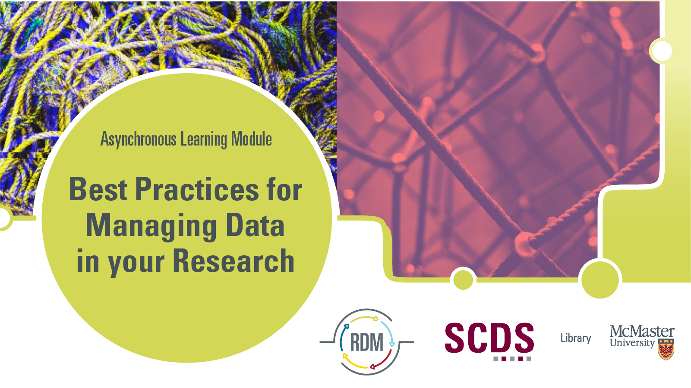

<!-- 
This will be the home page of your module. It should give a small introduction to the student about the workshop topic.
Add, edit, or remove any content below for the workshop in question. -->

<!-- Title slide image. Replace img src with your own, or comment this out. -->

<!-- Main header -->
# Best Practices for Managing Data in Your Research

In this introductory workshop, learn about research data management best practices and how investing a small amount of time in organizing your data now can save you a lot of time and prevent future headaches. We will go over best practices for data planning, storage, organization, preservation, and sharing.

## Land Acknowledgement
McMaster University is located on the territories of the Mississauga and Haudenosaunee nations, within the lands protected by the Dish With One Spoon wampum agreement. Research data management by and with First Nations, Métis, and/or Inuit requires alignment with Indigenous data sovereignty principles. These must be developed an approved by these communities. Examples of Indigenous data management practices include the First Nations Information Governance Centre’s [OCAP principles](https://fnigc.ca/ocap-training/), the [OCAS principles](https://umanitoba.ca/health-sciences/sites/health-sciences/files/2021-01/framework-research-report-fnmip.pdf) endorsed by the Manitoba Métis Federation, the principles of [Inuit Qaujimajatuqangit](https://doi.org/10.1139/as-2020-0015), ᐃᓄᐃᑦ ᑕᐱᕇᑦ ᑲᓇᑕᒥ (Inuit Tapiriit Kanatami) [National Inuit Strategy on Research](https://www.itk.ca/national-strategy-on-research-launched/), and Global Indigenous Data Alliance’s [CARE principles](https://www.gida-global.org/care). 

## Meet the RDM Team

Presentation by Danica Evering and Isaac Pratt, Research Data Management Specialists. A bit about us:

<b>Isaac Pratt, PhD</b> has a background in Biological Anthropology, Medical Imaging, and Human Anatomy. He has a PhD in Anatomy & Cell Biology from the University of Saskatchewan.

<b>Danica Evering, MA</b> has a background in social practice art, community-based research, and communications studies. They have an MA in Media Studies from Concordia University.

Learn more on our website at [rdm.mcmaster.ca](https://rdm.mcmaster.ca/research-data-management) or email us at [rdm@mcmaster.ca](mailto:rdm@mcmaster.ca?subject=[GitHub](%20RDM%20Best%20Practices)).

[Book an appointment with Danica, Isaac, or another member of the Sherman Centre Team.](https://libcal.mcmaster.ca/appointments/)

<!-- What will the student learn to do, learn to use, etc. -->
## Learning Objectives
By the end of this workshop, you will have learned about:
- The importance of data management plans
- File organization and data documentation fundamentals
- How to keep your data secure and how to store your data
- Different things to consider when publishing your data

<!-- Estimate the time the workshop will take to complete. Feel free to remove this. -->
## Duration
This module will take around 1 to 2 hours, however feel free to work at your own pace!

## Watch the Recording
If you'd prefer to watch a video version of this module, navigate to the "[Workshop Recordings](previousOffering)" page.
