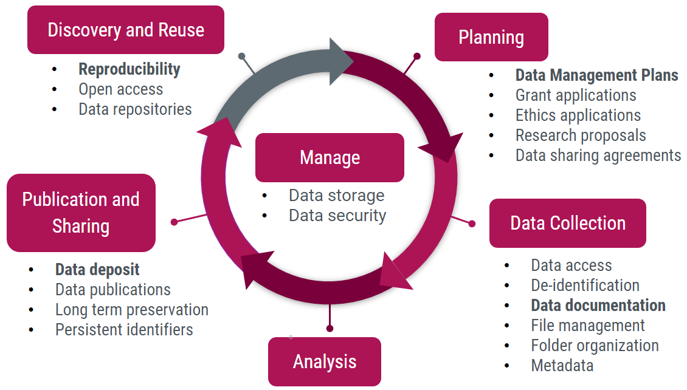

<!-- 
This page will go over introductory content to the workshop. 
If your workshop has an introduction sequence, whether it be history, "Why should you use __", or anything of that matter, this is where it goes! If your workshop doesn't need this, delete introduction.md from the repository. 
Add, edit, or remove any content below for the workshop in question. 
-->

# Workshop Introduction 

  

    Table of Contents
  

  {: .text-delta }
- TOC
{:toc}

<!-- Follow along with the introductory video, slides, or text below. -->

<!-- If your page has a video to go along with it, put it here. -->
<!-- <iframe height="416" width="100%" allowfullscreen frameborder=0 src="https://echo360.ca/media/a65689c0-c35c-4f33-9c12-f0ac97883f54/public?autoplay=false&automute=false"></iframe>
[View original here.](https://echo360.ca/media/a65689c0-c35c-4f33-9c12-f0ac97883f54/public?autoplay=false&automute=false) -->

<!-- If your page has slides/PDFs/worksheets to go along with it, put it here. -->
<!-- <embed width="100%" height="466" src="assets/docs/examplePDF.pdf" style="border:none;">
[Download slides here.](assets/docs/examplePDF.pdf) -->

<!-- Below the video/slides, this is where you put the text version of the page. -->
## What is Research Data Management?

Research Data Management (RDM) is the active process of organizing and maintaining data throughout a project's life cycle. You can think of it as an umbrella term for different practices and things you do as a researcher to ensure that your data is secure, accessible, usable, and remains intact over time.

RDM comprises of a number of activities throughout your project's lifecycle.

### Planning

In the planning phase, you might create a data management plan (DMP), which you might also present as part of a grant application, an ethics application, or a research proposal.

### Data Collection

Once you start data collection, you'll need to start managing the data. 

This can include things like managing who has access to the data, how it's documented, where you're putting your files, how you're organizing your folders and data, what kind of metadata you're keeping, and if you're working with sensitive data, how you're doing the identification of data.

### Analysis

The analysis phase of a project's life cycle is particularly complex, so it has its own support system outside of RDM.

### Publication and Sharing

After data analysis, you're going into the publication and sharing phase.

Many journalists now require data deposits, requiring you to deposit research data, metadata, and any code you might have used into a recognized data repository.

It's also important to think about the long-term preservation of your data and how you're going to connect your data sets and research to your research profile using persistent identifiers.

### Discovery and Reuse

Then comes the discovery and reuse phase, which covers concepts like reproducibility, open access, and data repositories.

### Manage

And of course, throughout the whole process, you have to keep your data stored and secure.

## Why is Research Data Management important?

Have you thought about how vulnerable your data might be?

### Questions to Consider

**In a year or two, will you be able to remember all the details of your experiments?**

- Probably not! It's a good idea to document any important, and even any little, details about your research. This will be important when it comes time to write your thesis or publish your research.

**What will happen to your data when you graduate, move, or retire?**

- Are you going to take your data with you, is your supervisor going to manage it, or is it simply going to stay in the lab? These are all important questions to think about.

**How much work would you have to do if you lost your data?**

- Nowadays, data loss is inevitable. Make a plan for your data as if your laptop or hard drive fails in a month.

**If you need to share your data with a collaborator, would they be able to understand it without your help?**

- Not only will documentation help you understand your own data down the line, but it will also help others understand your data. 

### Lost Laptops

We've all seen posters like these, perhaps through online posts on Twitter or Reddit. 

If you're storing your data on your laptop and it gets stolen or lost, do you have a backup you can rely on? If you had sensitive data on your laptop, how secure would it be? 

### Campus Fires

<ins>*Image credit: [ABC News](https://abcnews.go.com/International/brazil-suffers-incalculable-loss-massive-fire-engulfs-200/story?id=57577478)*</ins>

Even if you have your data stored on campus, things do happen. For example, a few years ago, the National Museum of Brazil burned down, and many researchers lost not only their data but their physical specimens that they were collecting data from.

In cases like these, it's really difficult to recover or recollect data.

<ins>*Image credit: [CTV News Winnipeg](https://winnipeg.ctvnews.ca/fire-may-have-destroyed-years-of-research-1.384027)*</ins>

A few years prior to that, the University of Manitoba had a large fire in the psychology building, which destroyed several labs. 

The university had to spend several million dollars on forensic data recovery over the span of a couple years. They were able to recover a lot of the data from the destroyed computers, however, as a master's or PhD student, you can't afford to wait that long for your data sets to be recovered.

### Missing Data

<ins>*Image credit: [Current Biology](https://doi.org/10.1016/j.cub.2013.11.014)*</ins>

The last thing to mention is that, as time passes, research data generally becomes less available or entirely lost. 

It's important for you to be mindful of storing your data in such a way that it will be accessible and preserved over the long term.

## Let's take a look at Dave

"Dave" is a graduate student working in Biomedical Science, focused on x-ray imaging of bone tissue samples. Dave's data is made up of three major components:
- Image files: x-ray images, microscope images
- Software and hardware configuration files: instrument-specific files, scripts, text files
- Measurement data files: spreadsheet files, tabular data

Dave's data is stored separately in a few places:
- Image files are quite large (2+ TB) and stored on lab computers and a collection of miscellaneous external hard drives accumulated over the years.
- The other files are smaller (~10 GB) and stored on a personal laptop and a cloud storage platform (OwnCloud).

The data is not consistently documented. Dave's lab is under a lot of pressure, and so rather than doing consistent documentation, he always moves onto the next experiment and the next data collection. The data is also not published or shared outside the research group except by direct request. No time or energy is put into archiving the research data.

### What went wrong for Dave?

This is a normal practice for a lot of researchers, where the research is so intense that we don't think we have time to do documentation and focus on preservation. 

In Dave's case, one of his external hard drives failed, leading to the loss of some of his data. This data loss was not discovered for several weeks, and there's no backup of this data. Since there's so much data and it's not well documented, Dave isn't sure which data sets he lost.

This leaves Dave with two options:
- Extend his degree while he recollects that data, or
- Publish what he can, even though the explanatory and statistical power of the study has been reduced.

### What could Dave do better in the future?

1. Dave could make a plan for his data.
    - A data management plan could help Dave avoid duplication of research and increase the use of existing data.
    - It can also save time and resources.

2. Dave could organize and document his data consistently.
    - It would help Dave remember what he does.

3. Dave could store and backup his data securely.
    - Backing-up his data would prevent data loss.
    - Securing data would protect research participants.
    
4. Dave could make sure his data is ready for archiving and sharing.
    - Getting his data ready would help meet funder and journal requirements.
    - This would also increase visibility and citation credits.

The rest of this workshop will go through these four major topics: data management planning, data organization and documentation, data storage and security, and finally data sharing and archival.
 