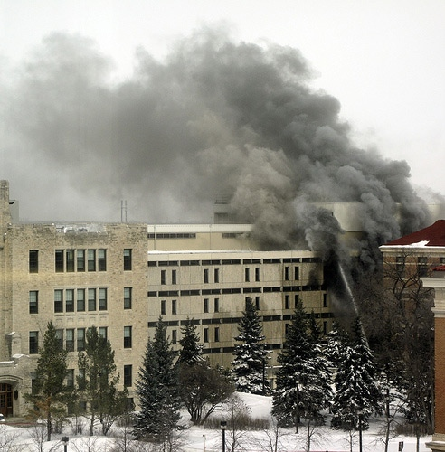

<!-- 
This page will go over introductory content to the workshop. 
If your workshop has an introduction sequence, whether it be history, "Why should you use __", or anything of that matter, this is where it goes! If your workshop doesn't need this, delete introduction.md from the repository. 
Add, edit, or remove any content below for the workshop in question. 
-->

# Workshop Introduction 

  

    Table of Contents
  

  {: .text-delta }
- TOC
{:toc}

<!-- Follow along with the introductory video, slides, or text below. -->

<!-- If your page has a video to go along with it, put it here. -->
<!-- <iframe height="416" width="100%" allowfullscreen frameborder=0 src="https://echo360.ca/media/a65689c0-c35c-4f33-9c12-f0ac97883f54/public?autoplay=false&automute=false"></iframe>
[View original here.](https://echo360.ca/media/a65689c0-c35c-4f33-9c12-f0ac97883f54/public?autoplay=false&automute=false) -->

<!-- If your page has slides/PDFs/worksheets to go along with it, put it here. -->
<!-- <embed width="100%" height="466" src="assets/docs/examplePDF.pdf" style="border:none;">
[Download slides here.](assets/docs/examplePDF.pdf) -->

<!-- Below the video/slides, this is where you put the text version of the page. -->

## Do I even have research data to manage? 

If your research involves biological samples or survey results, you may feel fairly confident you're working with research data. 

But what if your research is rooted in creative practice? What if you're looking for the specific heat of a material under a magnetic field? What if you're  What if you work with archives or lists of references? What if you're working on an industry-sponsored initiative? 

Research data and research materials can look very different in different fields. According to the [Tri-Agency RDM Policy FAQs](https://science.gc.ca/site/science/en/interagency-research-funding/policies-and-guidelines/research-data-management/tri-agency-research-data-management-policy-frequently-asked-questions#1c): 

"Research data are data that are used as primary sources to support technical or scientific enquiry, research, scholarship, or creative practice, and that are used as evidence in the research process and/or are commonly accepted in the research community as necessary to validate research findings and results."

Data can take many different forms, depending on the kind of research work you're undertaking. If you can use it as a building block to come up with new knowledge or understanding, it could qualify as research data. Research data inform findings or contributions that are then shared through research outputs: publications, knowledge translations, projects, and more. 

### Try this quick quiz - which of the following examples could count as research data?
<iframe src="https://h5pstudio.ecampusontario.ca/h5p/57134/embed" width="993" height="642" frameborder="0" allowfullscreen="allowfullscreen"></iframe>

## What is Research Data Management?

Research Data Management (RDM) is a suite of connected processes and practices applied throughout the research lifecycle, as data are planned for, collected, organized, documented, stored, preserved, shared, and reused, in support of analysis, research, creative works, and dissemination that benefit society. 

You can think of it as an umbrella term for different practices and things you do as a researcher to ensure that your data is secure, accessible, usable, and remains intact over time.

RDM comprises of a number of activities throughout your project's lifecycle.

### Planning

In the planning phase, you'll create a data management plan (DMP), which you might also present as part of a grant application, an ethics application, or a research proposal.

### Data Collection

Once you start data collection, you’ll need to start carrying out your data management plan.

This can include things like managing who has access to the data, how it’s documented through electronic lab notebooks or codebooks, where you’re putting your files and what you're naming them, how you’re organizing folders and data, what kind of metadata you’re keeping, what variables are called, and if you’re working with sensitive data, how you’re removing identifying information like names, ages, and more.

And of course, throughout the whole process, you have to keep your data stored and secure.

### Analysis

The analysis phase of a project's life cycle is particularly complex, so it has its own support system outside of RDM. Our colleagues in the [Data Analysis Support Hub](https://library.mcmaster.ca/services/dash), part of the [Sherman Centre for Digital Scholarship](https://scds.ca/) can help support researchers through this phase.

### Publication and Sharing

After data analysis, you’re ready to write up your research and publish it in a journal.

In addition to publishing an article, many journals now also require you to deposit or share research data, metadata, and any code you might have used in a recognized data repository.

It’s also important to think about the long-term preservation of your data and how you’re going to connect your data sets and research to your research profile using persistent identifiers. 

### Discovery and Reuse

Then comes the discovery and reuse phase--making sure your research is reproducible, that articles are available open access, and connected to research data in data repositories.

## Why is Research Data Management important?

Have you thought about how vulnerable your data might be?

### Questions to Consider

**In a year or two, will you be able to remember all the details of your experiments?**

- Probably not! It's a good idea to document any important, and even any little, details about your research. This will be important when it comes time to write your thesis or publish your research.

**What will happen to your data when you graduate, move, or retire?**

- When you move to a new school or retire, are you going to take your data with you? If you're a graduate student, is your supervisor going to manage it, or is it simply going to stay in the lab? These are all important questions to think about.

**How much work would you have to do if you lost your data?**

- Nowadays, data loss is inevitable. Make a plan for your data as if your laptop or hard drive fails in a month.

**If you need to share your data with a collaborator, would they be able to understand it without your help?**

- Not only will documentation help you understand your own data down the line, but it will also help others understand your data. 

### Lost Laptops and Hard Drives

We've all seen posters like these, perhaps through online posts on Twitter or Reddit. 

If you're storing your data on your laptop and it gets stolen or lost, do you have a backup you can rely on? If you had sensitive data on your laptop, how secure would it be? 

### Campus Fires, Floods, and Environmental Disasters

<ins>Image credit: [ABC News](https://abcnews.go.com/International/brazil-suffers-incalculable-loss-massive-fire-engulfs-200/story?id=57577478)</ins>

Even if you have your data stored on campus, things do happen. For example, a few years ago, the National Museum of Brazil burned down, and many researchers lost not only their data but their physical specimens that they were collecting data from.

In cases like these, it's really difficult to recover or recollect data.

<ins>Image credit: [CTV News Winnipeg](https://winnipeg.ctvnews.ca/fire-may-have-destroyed-years-of-research-1.384027)</ins>

A few years prior to that, the University of Manitoba had a large fire in the psychology building, which destroyed several labs. 

The university had to spend several million dollars on forensic data recovery over the span of a couple years. They were able to recover a lot of the data from the destroyed computers, however, as a master's or PhD student, you can't afford to wait that long for your data sets to be recovered.

### Missing Data

<ins>Image credit: [Current Biology](https://doi.org/10.1016/j.cub.2013.11.014)</ins>

The last thing to mention is that, as time passes, research data generally becomes less available or entirely lost. 

It's important for you to be mindful of storing your data in such a way that it will be accessible and preserved over the long term.

## Let's take a look at Dave

<!-- Change size of Dave's Div using the width of the div-->

    
  <ins>Image credit: [National Cancer Institute on Unsplash](https://unsplash.com/photos/XrLSV-CKmuQ)</ins>

"Dave" is a graduate student working in Biomedical Science, focused on x-ray imaging of bone tissue samples. Dave's data is made up of three major components:
- Image files: x-ray images, microscope images
- Software and hardware configuration files: instrument-specific files, scripts, text files
- Measurement data files: spreadsheet files, tabular data

Dave's data is stored separately in a few places:
- Image files are quite large (2+ TB) and stored on lab computers and a collection of miscellaneous external hard drives accumulated over the years.
- The other files are smaller (~10 GB) and stored on a personal laptop and a cloud storage platform (OwnCloud).

The data is not consistently documented. Dave's lab is under a lot of pressure, and so rather than doing consistent documentation, he always moves onto the next experiment and the next data collection. The data is also not published or shared outside the research group except by direct request. No time or energy is put into archiving the research data.

### What went wrong for Dave?

This is a normal practice for a lot of researchers, where the research is so intense that we don't think we have time to do documentation and focus on preservation. 

In Dave's case, one of his <b>external hard drives</b> failed, leading to the loss of some of his data. This data loss was not discovered for several weeks, and there's <b>no backup</b> of this data. Since there's so much data and it's <b>not well documented</b>, Dave isn't sure which data sets he lost.

This leaves Dave with two options:
- Extend his degree while he recollects that data, or
- Publish what he can, even though the explanatory and statistical power of the study has been reduced.

### What could Dave do better in the future?

**1)**&nbsp; Dave could **[make a plan for his data](topics/1-dmp.md)**.

  

  - A data management plan could help Dave avoid duplication of research and increase the use of existing data.
  - It can also save time and resources.
  

**2)**&nbsp; Dave could **[organize and document](topics/2-organization-and-documentation.md)** his data consistently.

  

  - It would help Dave remember what he does.
  

**3)**&nbsp; Dave could **[store and backup](topics/3-security-and-storage.md)** his data securely.

  

  - Backing-up his data would prevent data loss.  
  - Securing data would protect research participants.
  

**4)**&nbsp; Dave could make sure his data is ready for **[archiving and sharing](topics/4-publishing.md)**.

  

  - Getting his data ready would help meet funder and journal requirements.
  - This would also increase visibility and citation credits.
  

The rest of this workshop will go through these four major topics: data management planning, data organization and documentation, data storage and security, and finally data sharing and archival.
