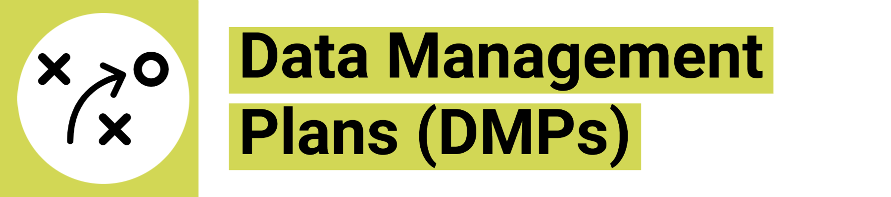
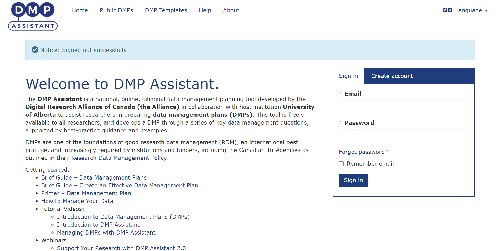
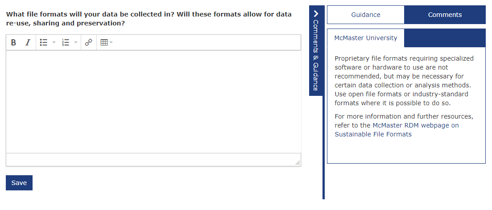

<!-- 
This page is an example lesson template.
Add, edit, or remove any content below for the workshop in question. -->

<!-- Putting a {: .no_toc} above a header removes it from the table of contents -->

{: .no_toc}  
# Data Management Plans (DMPs)
Data Management Plans are used to plan, organize, and document how you're going to use your data throughout your research project.

<!-- This is your table of contents. You don't need to touch it, it automatically creates it when you add or remove headers. If you do not want a header to be included, put {: .no_toc } above the header line, as you can see above with Lesson 1 - Lesson Name. Make sure that there's also an empty line above {: .no_toc }... Markdown is picky about this :( -->

  

    Table of Contents
  

  {: .text-delta }
- TOC
{:toc}

<!-- A video for your lesson (if applicable) -->
<!-- ## Lesson Video
The following video demonstrates each of the steps outlined below in text.

<iframe height="416" width="100%" allowfullscreen frameborder=0 src="https://echo360.ca/media/a65689c0-c35c-4f33-9c12-f0ac97883f54/public?autoplay=false&automute=false"></iframe>
[View original here.](https://echo360.ca/media/a65689c0-c35c-4f33-9c12-f0ac97883f54/public?autoplay=false&automute=false) -->

<!-- Text content format for your lessons if you don't want to rely on videos, or want to provide another format of learning consumption. -->
## What is a Data Management Plan?

A Data Management Plan (DMP) is a living document describing your plan for how you will manage your research data. As a living document, this will be something you'll work with as you go through your research process and adapt as things change during your research. 

The best time to start making your DMP is at the start of your research. It's meant to be a proactive process that helps you anticipate and identify opportunities and challenges in managing your data before they emerge, so that you're under a little less pressure during your research. 

A good DMP covers the management of data both **during** the active phases of your research and **after** the completion of the research project. 

Research almost always a team effort. DMPs are a great way to get on the same page as collaborators. If you're working as team, discuss and develop your DMP with anyone who will be part of collecting, analyzing, and storing the data: research assistants, coordinators, and other staff. This can become part of your onboarding workflow. If you're a graduate student, your supervisor can review and comment on your DMP. If you're working with research participants, your DMP could be reviewed by community leadership, partner organizations, and the participants themselves--this is especially important for Indigenous research data. As ever, the many staff who support research can also contribute: RDM professionals, IT units, archivists and librarians, research offices, ethics boards, and more. 

Some research funders require grant applicants to submit a DMP. In the US, the [National Science Foundation (NSF)](https://new.nsf.gov/funding/data-management-plan) and the [National Institutes of Health (NIH)](https://sharing.nih.gov/data-management-and-sharing-policy) both require DMPs (or a variant) to be submitted with the grant application. The [Wellcome Trust](https://wellcome.org/grant-funding/guidance/how-complete-outputs-management-plan) in the UK also requires a DMP, as do a lot of the other European funders. Recently, the [Tri-Agency (SSHRC, NSERC, and CIHR)​](https://science.gc.ca/site/science/en/interagency-research-funding/policies-and-guidelines/research-data-management/tri-agency-research-data-management-policy) has also started requiring DMPs as part of grant applications.

## What goes in a Data Management Plan?

Pretty much anything that pertains to your research data will go into your data management plan. More specifically:

<table>
  <tbody>
    <tr>
      <td><b>Data Collection</b></td><td><ul>
        <li>What types of data will you collect?</li>
        <li>What file formats will you gather?</li>
        <li>How will files be version-controlled, organized, and named?</li>
      </ul></td>
    </tr>
    <tr>
      <td><b>Documentation and Metadata</b></td><td><ul>
        <li>What documentation will help others understand your data in the future?</li>
        <li>What metadata--data about data--will you collect?</li>
        <li>What data sets are you using, or what new data will be created?</li>
      </ul></td>
    </tr>
    <tr>
      <td><b>Storage and Backup</b></td><td><ul>
        <li>How are you going to store and backup your data?</li>
        <li>How are you going to keep your data secure?</li>
        <li>If you're working with a research team, how will the team access and contribute data?</li>
      </ul></td>
    </tr>
    <tr>
      <td><b>Preservation</b></td><td><ul>
        <li>Where will you deposit your data at the end of your research project?</li>
        <li>How will you ensure data is accessible through preservation-friendly formats?</li>
      </ul></td>
    </tr>
    <tr>
      <td><b>Sharing and Reuse</b></td><td><ul>
        <li>What data will you share in what form?</li>
        <li>What license will you use to tell others how they can use it?</li>
        <li>How will you tell your research community your data exists?</li>
      </ul></td>
    </tr>
    <tr>
      <td><b>Responsibilities and Resources</b></td><td><ul>
        <li>Who is responsible for managing the data sets?</li>
        <li>What happens if the person responsible needs to step away or moves?</li>
        <li>What kind of resources are required to ensure that it’s well managed?</li>
      </ul></td>
    </tr>
    <tr>
      <td><b>Ethics and Legal Compliance</b></td><td><ul>
        <li>How will sensitive data be managed and access restricted?</li>
        <li>Do you have a data-sharing agreement that you have to follow?</li>
        <li>Have you gone through ethics approval?</li>
        <li>Are there any ethical terms you have to follow regarding your data?</li>
      </ul></td>
    </tr>
  </tbody>
</table>

<!-- <b>[Try this quick quiz - which of the following statements is true about DMPs?]
(https://forms.office.com/Pages/ResponsePage.aspx?id=B2M3RCm0rUKMJSjNSW9HcgnYn5K4fIxDk7z2v_ZuozpUQURaSVZBRDJFTzJBRElRUzhURFlOWUo5RC4u&embed=true)</b> -->

### Try this quick quiz - which of the following statements is *true* about DMPs?

<iframe width="100%" height="480px" src="https://forms.office.com/Pages/ResponsePage.aspx?id=B2M3RCm0rUKMJSjNSW9HcgnYn5K4fIxDk7z2v_ZuozpUQURaSVZBRDJFTzJBRElRUzhURFlOWUo5RC4u&embed=true" frameborder="0" marginwidth="0" marginheight="0" style="border: solid 2px #7a003c; max-width:100%; max-height:100vh; border-radius: 10px" allowfullscreen webkitallowfullscreen mozallowfullscreen msallowfullscreen> </iframe>

## DMP Assistant

The best way to build a Data Management Plan is to use [DMP Assistant](https://assistant.portagenetwork.ca/).

DMP Assistant is a web-based data management planning tool that's available to all researchers in Canada for free.

After making an account and logging in to the website, DMP Assistant will ask you a series of questions about your data management practices. By answering these questions, you are essentially filling in and creating your data management plan.

The website offers lots of data management guidance and links, including McMaster-specific guidance on what kind of resources are available to you here. At the end, you're able to export your document into a PDF document, a Word document, or just about any other format you'd like.

You can also add collaborators or other researchers to the site so that you can work on the DMP together. 

To check out DMP Assistant, you can go to <https://assistant.portagenetwork.ca/>.

McMaster RDM Services has developed a "McMaster General Purpose DMP Template" which has specific guidance for services and resources at our university. Just click the "Write Plan" button and click on the "Comments and Guidance" sidebar in each section.

We also offer a full workshop on Data Management Plans and using DMP Assistant. You can find that here: <https://scds.github.io/intro-rdm/dmp.html>.

<!-- Summarize your learning objectives here. It acts as a reminder to the learner about what they just learned, as well as a checklist for you to make sure you covered everything you wished to cover. -->
## Key Points / Summary

- DMPs are living documents that should be used and updated regularly throughout the entirety of the project's life cycle.
- Some research funders require applicants to submit a DMP.
- The seven topics that a DMP should cover are Data Types and Data Collection, Documentation and Metadata, Storage and Backup, Preservation, Sharing and Reuse, Responsibilities and Resources, and Ethics and Legal Compliance
- DMP Assistant provides some McMaster-specific guidance on what kinds of resources are available to you in the "guidance and comments" sidebar.

<!-- You can add your additional resources for a specific lesson here, however there is also an additional resources page alongside the conclusion at the end of the workshop website. -->
## Additional Resources
- [DMP Assistant](https://assistant.portagenetwork.ca/)
- DMP and DMP Assistant Workshop: [Building a Data Management Plan for your Research Project](https://scds.github.io/intro-rdm/dmp.html)
- Digital Research Alliance of Canada (formerly Portage Network) [DMP Exemplars and Templates](https://alliancecan.ca/en/services/research-data-management/learning-and-training/training-resources#heading-dmp-exemplars)
