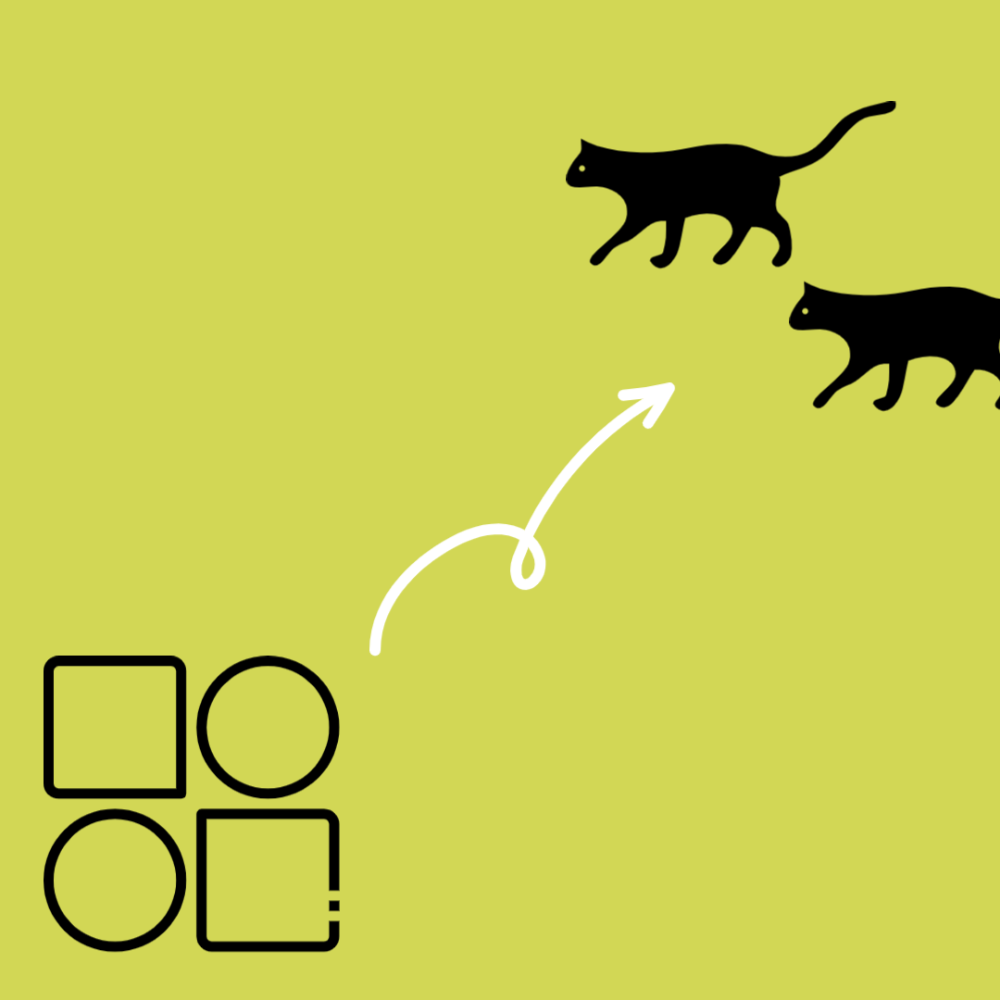
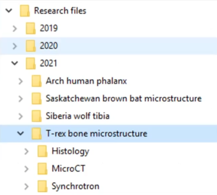
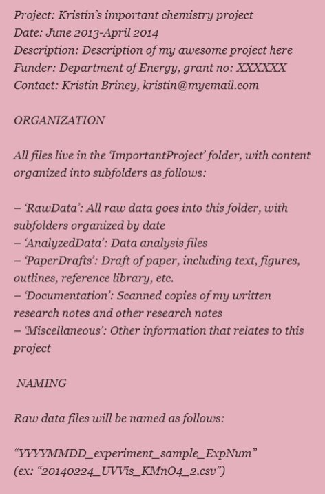

{: .no_toc}  
# Organization and Documentation
Data documentation and organization supports how findable, accessible, interoperable, and reusable your data is.

  

    Table of Contents
  

  {: .text-delta }
- TOC
{:toc}

<!-- ## Lesson Video
The following video demonstrates each of the steps outlined below in text.

<iframe height="416" width="100%" allowfullscreen frameborder=0 src="https://echo360.ca/media/a65689c0-c35c-4f33-9c12-f0ac97883f54/public?autoplay=false&automute=false"></iframe>
[View original here.](https://echo360.ca/media/a65689c0-c35c-4f33-9c12-f0ac97883f54/public?autoplay=false&automute=false) -->

## Organize and Document your Data

Raw data isn't easy to understand and re-use. Raw numbers in a spreadsheet can be hard to interpret, and variable names might have abbreviations that make it hard for others to understand what it truly is *(What did you mean when you made this column "cat2"? [Did it mean cat, category, or something else?](https://medium.com/@samanthaming/bad-variable-names-to-avoid-%EF%B8%8F-bbab6614f36))*. 

To make data easier to understand, create data documentation that follows the [FAIR principles](https://www.go-fair.org/fair-principles/), which states that data should be Findable, Accessible, Interoperable, and Reusable.

Some key questions:
- If you need to use data you collected over a year ago, how easy would they be to find and use?
- Would you know what all the variables and file names mean?
- Would you have information about when/where/how the data was collected?
- Have you ever gone to analyze data or publish a paper only to find that some critical piece of information was not recorded, or you don't remember where you wrote it down?

Good documentation and organization helps research reliability, validity, reproducibility, and integrity. 

## Research Project Management

When doing your research, there are a lot of tools that can make your life easier.

Collaboration
: [Google Docs](https://www.google.ca/docs/about/) and [Microsoft Office](https://www.office.com/) let your team work documents in real-time, avoiding multiple versions and copies sent by email.

Reference Management
: [Zotero](https://www.zotero.org/), [Mendeley](https://www.mendeley.com/), and [EndNote](https://endnote.com/) support collaboration through shared citation libraries. Zotero is a free open-source resource that lets you take your library with you if you change institutions. [McMaster also provides a paid license to EndNote for free](https://library.mcmaster.ca/databases/endnote) for everyone on campus.

Notetaking Software
: [Obsidian](https://obsidian.md/), [Evernote](https://evernote.com/), [OneNote](https://www.onenote.com/?404&public=1), [Notion](https://www.notion.so/), or an Electronic Lab Notebook allow you to create organized, linked notes that you can use to document your research practices.

Open Science Framework (OSF)
: The [Open Science Framework (OSF)](https://osf.io/) is a free platform for research collaboration lets you manage files, data, code, and protocols in one central location. If you want to learn more, check out our [workshop for project organization using the OSF](https://scds.github.io/intro-rdm/osf.html).

## File Organization

Something very basic that we sometimes slack on is keeping files organized. The key to organizing files is to make it a habit.

Keeping your files organized makes it easier to know where files are and where new files should go.

  

    File organization schemes include: 
    <ul>
      <li>By project</li>
      <li>By researcher</li>
      <li>By experiment type</li>
      <li>By date (often year)</li>
      <li>By some combination of the above</li>
      <li>ie a two level structure of year -> project</li>
    </ul>
  

   

The example above shows files organized by year (2021), followed by project (T-rex bone microstructure), and then experiment type (Histology). 

## File Naming

Once you've come up with a solid folder structure, you can start giving your files good names.

Organizing your research files makes your data easier to understand, share, and archive - both now and in the future. A good file organization system should be descriptive, standardized, and implemented consistently.

Some key things that you might want to include in a file name include a date, a reference to the project, perhaps a short description, and maybe even the initials of the researcher that created the file. Version numbers and even locations are sometimes included as well.

The goal of file naming is to make your files easy to search for, and easy to understand.

*e.g. 2022_10_01_LakeMercury_TestData1_TM_v3.csv*

The file name above includes:

Date
: 2022_10_01 (collection date)

Project Name
: LakeMercury

Short Description
: TestData1

Name
: TM (Tracy MacDern)

Version Number
: v3

Without even having seen or worked on this file, you can easily understand what it is.

{: .note-title}
> Tip
>
> If you write dates at the start of your files with the year, month, and day (in that order), the file system on your computer will automatically organize them by date when you're sorting your files alphabetically.

Once you've established a file organization and naming system, describe it in a README file for your research project and make sure everyone on your research team knows the system.

### Try this quick quiz - how do you make a descriptive file and folder system?
<iframe src="https://h5pstudio.ecampusontario.ca/h5p/57140/embed" width="672" height="288" frameborder="0" allowfullscreen="allowfullscreen"></iframe>

## Documentation Files

Once you have file names, and you have folder organization, you can start to think about documentation files.

Documentation files come in a number of different formats.

README
: A simple text document (.txt) that describes folder hierarchy and file organization, description of important file contents, and any other important project information.

Data Dictionaries
: A document for tabular data that describes names, labels, units, and contraints.

Codebooks
: Like data dictionaries but for suvery or statistical data - includes the survey layout and structure, and codes for questions and answers.

<h3>Example README file</h3>

  

    
You can find an portion of an example README documentation file on the right side.

    
It starts off with some of the important project information, such as the project's name, the date that the project took place in, a small description about the project, funder information, and finally the researcher's contact information.

    
It then mentions the file organization system, followed by any naming coventions that the files follow.

    
Keeping an active README for your project is a key best practice. You can also expand on this with other details such as licenses, related publications, data and file overviews, and methodological information if you share your data.

  

  

     
    <i><ins>Image credit: <a href="http://dataabinitio.com/?p=378">Data Ab Initio</a></ins></i>
  

{: .important-title}
> Build a documentation scheme you will actually use!
> 
> The most important aspect of documentation is doing it. If you choose a system that's too complicated, you're less likely to follow it.
> 
> Whatever file naming and organization scheme you choose, make sure it's descriptive, use it consistently, and document it (in a README.txt file).
>
> Take advantage of the software that is out there, including note-taking software, reference management software, and collaboration software.

### Try this quick quiz - what should go in a README file?

<iframe src="https://h5pstudio.ecampusontario.ca/h5p/57141/embed" width="672" height="408" frameborder="0" allowfullscreen="allowfullscreen"></iframe>

## Key Points / Summary

- Data documentation supports the reusability and interoperability of your research.
- There are lots of tools designed to make your life easier.
- Build a documentation scheme you will actually use.

## Additional Resources

- [RDM Website - Organize](https://rdm.mcmaster.ca/organize)
- [FAIR Principles](https://www.go-fair.org/fair-principles/)
- [McMaster-specific README template](../assets/docs/YYYYMMDD_AUTHOR_DATASET_README.docx)

### Research Project Management Software
- [Google Docs](https://www.google.ca/docs/about/), [Microsoft Office](https://www.office.com/)
- [Zotero](https://www.zotero.org/), [Mendeley](https://www.mendeley.com/), [EndNote](https://endnote.com/)
- [Obsidian](https://obsidian.md/), [Evernote](https://evernote.com/), [OneNote](https://www.onenote.com/?404&public=1), [Notion](https://www.notion.so/)
- [Open Science Framework](https://osf.io/)
  - Check out our workshop on OSF: [Organize Your Research Projects with the Open Science Framework (OSF)](https://scds.github.io/intro-rdm/osf.html)
