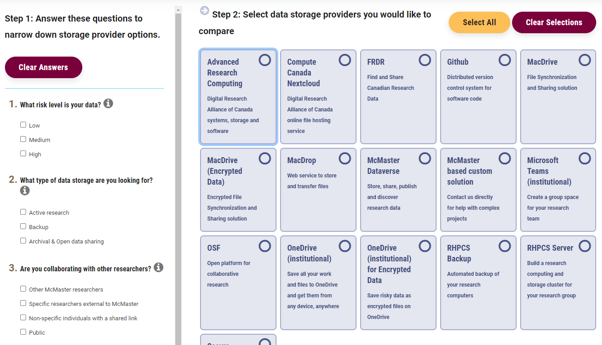

{: .no_toc}  
# Data Security and Storage

Data security is important not only to prevent unwanted access to your data, but also to prevent data loss.

  

    Table of Contents
  

  {: .text-delta }
- TOC
{:toc}

<!-- ## Lesson Video
The following video demonstrates each of the steps outlined below in text.

<iframe height="416" width="100%" allowfullscreen frameborder=0 src="https://echo360.ca/media/a65689c0-c35c-4f33-9c12-f0ac97883f54/public?autoplay=false&automute=false"></iframe>
[View original here.](https://echo360.ca/media/a65689c0-c35c-4f33-9c12-f0ac97883f54/public?autoplay=false&automute=false) -->

## Backup Strategies (3-2-1)

The best thing you can do for data storage is make sure that you have backups.

A good data storage plan should balance making your data easily accessible, but also reliable and secure.

The good rule of thumb is:
- **3** copies of your data (at least!)
- **2** copies are on-hand (easily accessible) on different systems (internal hard drive, cloud storage, etc)
  - a "production" (working) copy
  - a "production backup" copy
- **1** copy is in another location ("off-site") from the others with a trusted service provider

{: .new-title}
> Example
>
> 1 copy is stored locally on hard drive for analysis  
> 1 copy is stored on cloud storage platform  
> 1 copy is stored in a secure campus drive

If you want to learn more about data backups, check out our workshop "[Strategies for Research Data Storage and Backup](https://scds.github.io/intro-rdm/storage.html)".

## Research Data Storage Finder Tool

McMaster provides a research data storage finder tool online which is an interactive tool to help you find, compare, and get access to different storage solutions depending on risk, volume, and other needs.

You can access this tool at <https://rdm.mcmaster.ca/finder>.

 

## How Should I Protect my Data?

### Encrypt Sensitive Data

Sensitive data is any data that could cause harm if released openly. This includes personally identifiable information and personal health information.

- Use "Full disk encrpytion" if you are using a personal computer or laptop. This is called FileVault on Mac OS and "device encryption" or Bitlocker on Windows.
- Encrypt individual files in Microsoft Office using the "Protect Document" function.
- Other files can be encrypted using Disk Utility on Mac OS or with a third-party tool like [VeraCrypt](https://www.veracrypt.fr/en/Home.html).

For more details about working with and managing sensitive data, check out our workshop "[Securely Managing and Publishing Sensitive Data](https://scds.github.io/intro-rdm/sensitive.html)".

### Enable Multi-Factor Authenticator (MFA)

- Also known as 2 factor authentication (2FA).
- Requires more than one code or 'Factor' to login - typically 2 factors: password and a security code sent to your phone number or generated by a linked authenticator app.
- Many other web services (Gmail, Dropbox, etc) support MFA.

### Password Best Practices

Make sure your online information is secure by ensuring your password is:

**Strong**
: Make a strong password by combining a series of numbers, letters, and symbols into a long series of words. Try to combine them into something memorable - Like L1br@ryt1pS.

**Unique**
: Use a different password for every website/service.

**Secret**
: Never share your passwords with anybody, even if you trust them. Keep your passwords secret by storing them only in your head. Never send them in an email!

**Fresh**
: Change your password at least once every three months.

**Devices**
: Use a strong password on your computer and phone, too.

{: .note-title}
> Tip
>
> Remembering multiple passwords can be difficult. Use a trusted password manager to keep track of your passwords for you. Some examples are [BitWarden](https://bitwarden.com/) and [1Password](https://1password.com/).

### Common Password Mistakes

Make sure your passwords aren't:

Written Down
: Passwords written down on a piece of paper or stored in plain text on a computer may be stolen by somebody with malicious intent or easily lost.

Too Simple
: Simple or common passwords are easy to guess or brute force. Examples: apple, rowboat, bumblebee, blizzard, password, admin

Identical
: Using the same password for multiple websites is like having one key for multiple locks; if it's stolen, the thief can open them all.

For more tips on data privacy, check out our [Data Privacy Best Practices](https://scds.github.io/intro-rdm/privacy.html) workshop.

## Key Points / Summary

- Data security can prevent unwanted data access and data loss.
- You should have 3 copies of your data, 2 of which should be easily accessible, and 1 should be stored in another location.

## Additional Resources
- [Research Data Storage Finder Tool](https://rdm.mcmaster.ca/finder)
- Disk Encryption Tool: [VeraCrypt](https://www.veracrypt.fr/en/Home.html)
- Password Managers: [BitWarden](https://bitwarden.com/), [1Password](https://1password.com/)

### Workshops
- [Strategies for Research Data Storage and Backup](https://scds.github.io/intro-rdm/storage.html)
- [Securely Managing and Publishing Sensitive Data](https://scds.github.io/intro-rdm/sensitive.html)
- [Data Privacy Best Practices](https://scds.github.io/intro-rdm/privacy.html)