{: .no_toc}  
# Data Publishing
What will you do with your data and research once you've wrapped up your project?

  

    Table of Contents
  

  {: .text-delta }
- TOC
{:toc}

<!-- ## Lesson Video
The following video demonstrates each of the steps outlined below in text.

<iframe height="416" width="100%" allowfullscreen frameborder=0 src="https://echo360.ca/media/a65689c0-c35c-4f33-9c12-f0ac97883f54/public?autoplay=false&automute=false"></iframe>
[View original here.](https://echo360.ca/media/a65689c0-c35c-4f33-9c12-f0ac97883f54/public?autoplay=false&automute=false) -->

## Publishing Data

What do you plan to do with your data once your project is finished and your research has been published? How will you ensure that your data remains accessible (to you and others) in the long-term? Consider the advantages of publishing your datasets in an online repository for preservation and sharing.

## Open Research
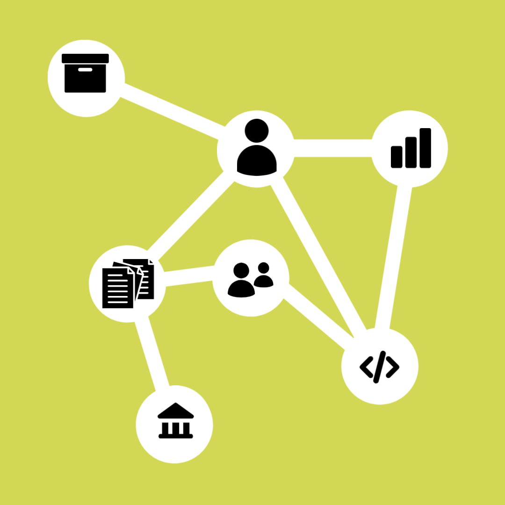
Open research is an initiative that allows others to freely access and contribute to your research. Some parts of open research include open data, open-source software, open access, and open government. You might be familiar with open research and might have even participated in other open movements. Maybe you've edited Wikipedia, grabbed a code snippet from Stack Overflow, or downloaded a pattern to 3D print. Open initiatives centre around principles of collaboration and transparency. 

Open research is often publicly funded. In addition to important research integrity measures such as transparency, accountability, and reproducibility for other researchers, open research also allows data to be framed as a "public good." 

However, while open research is an important initiative, not all data can or should be shared. Any data that can be considered sensitive--personally identifiable information, medical information, and more--should not be shared publicly. Data should be ["as open as possible, as closed as necessary."](https://ec.europa.eu/research/participants/data/ref/h2020/grants_manual/hi/oa_pilot/h2020-hi-oa-data-mgt_en.pdf)

## What is Data Sharing?
Sharing research data benefits you as a researcher and the whole research community. Open access to data allows for the verification and reproduction of research. The best way to share data is to publish it on a recognized data repository. This also helps archive your data for the long-term, entrusting its care to data curators instead of maintaining it yourself. 

### Research Scenario without Data Sharing

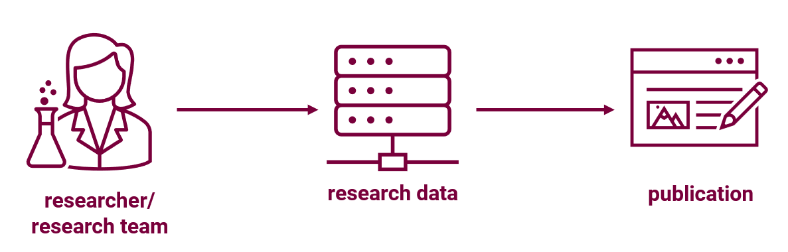

In a typical scenario, you'll have a researcher or research team that has just finished their research process. As a result of their research, they'll have gathered research data, which supports a publication or journal. The research data, however, is not made publicly available.

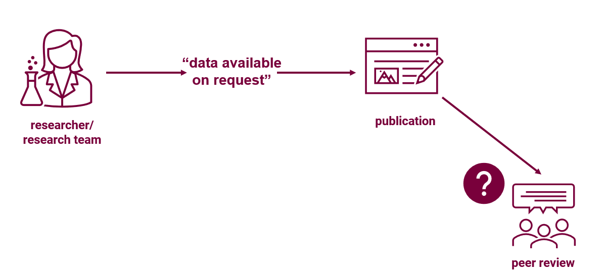

Once the research goes through a peer review process, you might be able to send the data directly to peer reviewers for them to analyze. However, after the article is published, data becomes harder to access. We often see the phrase "data available on request" at the bottom of an article. In practice, there are often big delays in receiving data in this manner, and it can be quite difficult to contact the researcher as well.

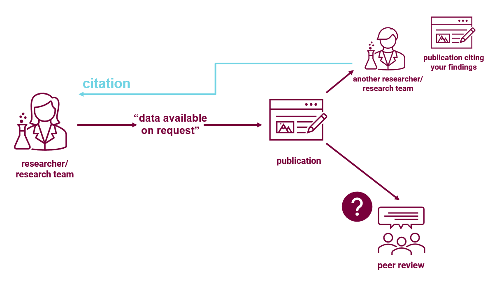

Later on, another researcher or research team might contact the original researcher for the research data so that they can try reproducing it, building upon it, or re-analyzing it as part of their own research. However, original researcher might be hard to contact, or they might no longer have access to the data. This can make it hard for researchers to trust the paper's findings without the original data to back them up, and this can even lead to article retractions. They might cite your publication, but are unable to cite your data. 

### Research Scenario with Data Sharing

In a data sharing scenario, the process starts exactly the same way. A researcher or research team would have finished their research process and published their findings.

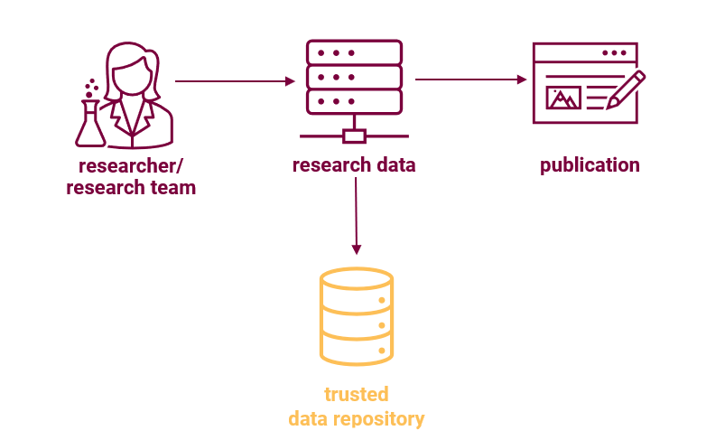

However, in this context, the researcher deposits their data into a trusted data repository. Now, the data is easily accessible to researchers.

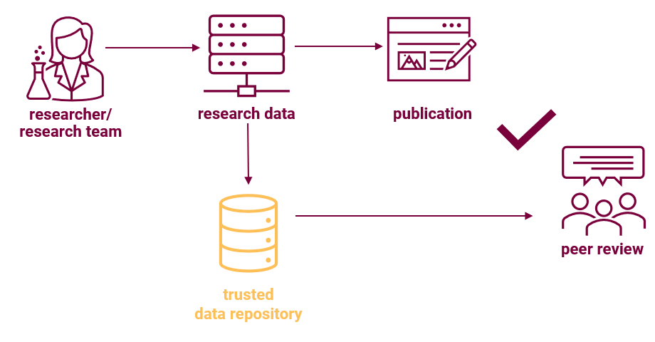

Any researcher participating in the peer review process can easily access the data, but any other researcher can also verify the data easily.

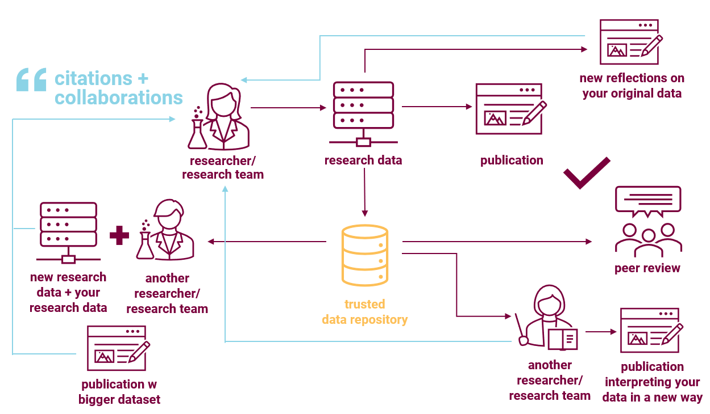

Now that the research data is easily accessible in a trusted data repository, other researchers can use this secondary data for several other purposes. 

A researcher could use the original methodology and approach to gather new research data, combine it with the original data into a publication with a bigger dataset. 

A researcher could interpret the original data in their own way, potentially even in a different field, producing another paper.

Or, the original researcher can also come back and make new reflections on the original data.

All of this leads to further citations, collaborations, and partnerships, which are beneficial to the original researcher as well as the research community.

## Why Share Data?

### Citation Impact

Studies show that publications with open data are cited more.
- Publications in PLOS and BMC journals with open data have up to a 25% higher citation impact compared to those that don't share data. [^1]
- Publications of gene expression microarray data have a higher citation impact when the data is shared. [^2]

[^1]: Collavazi et al, 2020 PLOSOne The citation advantage of linking publications to research data <https://doi.org/10.1371/journal.pone.0230416>
[^2]: Piwowar & Vision, 2013 PeerJ Data reuse and the open data citation advantage <https://doi.org/10.7717/peerj.175>

### Journal and Publisher Requirements

Many journals are starting to require data sharing or at least data availability statements, including:
- PLOS: [journals.plos.org/plosone/s/data-availability](https://journals.plos.org/plosone/s/data-availability)
- Nature: [nature.com/nature-portfolio/editorial-policies/reporting-standards](https://www.nature.com/nature-portfolio/editorial-policies/reporting-standards)
- NEJM: [nejm.org/about-nejm/editorial-policies](https://www.nejm.org/about-nejm/editorial-policies)

Journals with higher impact factors are more likely to have data sharing policies.

### Funder Requirements
Data Deposit is part of the [Tri-Agency Research Data Management Policy](https://science.gc.ca/site/science/en/interagency-research-funding/policies-and-guidelines/research-data-management/tri-agency-research-data-management-policy). 

> "Grant recipients are required to deposit into a digital repository all digital research data, metadata and code... in journal publications and pre-prints."

<b><u>Grant recipients will not be required to openly share data.</u></b> Rollout will follow review of institutional strategies and in line with readiness of Canadian research community. SSHRC and some CIHR data is already required to be deposited.

CIHR currently requires researchers to "Deposit bioinformatics, atomic, and molecular coordinate data into the appropriate public database."

SSHRC also requires researchers to "make available for use by others all research data collected with the use of SSHRC funds".

To find out more about the Tri-Agency data requirements, check out our webinar "[What you need to know about the Tri-Agency RDM Policy](https://scds.github.io/intro-rdm/triagency.html)" and the [Tri-Agency Research Data Management Policy](https://science.gc.ca/site/science/en/interagency-research-funding/policies-and-guidelines/research-data-management/tri-agency-research-data-management-policy).

The Tri-Agency's Data Deposit requirement aligns Canadian research with international funders, such as the [National Institutes of Health (NIH)](https://sharing.nih.gov/data-management-and-sharing-policy) in the USA, the [UK Research and Innovation](https://www.ukri.org/manage-your-award/publishing-your-research-findings/making-your-research-data-open/), and others.

### Try this quick quiz - why might researchers might want to share datasets?

<iframe src="https://h5pstudio.ecampusontario.ca/h5p/57144/embed" width="672" height="432" frameborder="0" allowfullscreen="allowfullscreen"></iframe>

## Where do I put my data?

A data repository is a web platform and storage space for researchers to deposit datasets associated with their research.

Repositories provide:
- long term storage and access to research data beyond the life of a grant, research project, or individual careers.
- discoverability and findability for datasets through features like indexing and DOIs.
- easy-to-use shared platforms made for research.

There are thousands of data repositories available for you to use. A few types of repositories include:
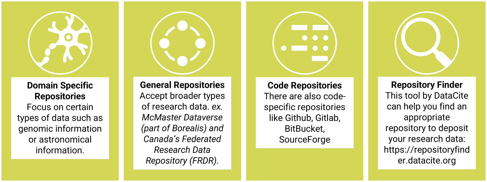

Domain-Specific Repositories
: Focus on certain types of data, such as genomic information or astronomical information. [Nature's Data Repository Guidance](https://www.nature.com/sdata/policies/repositories#) can be helpful in narrowing down possibilities.

General Repositories
: Accept broader types of research data, e.g. [McMaster Dataverse (part of Borealis)](https://borealisdata.ca/dataverse/mcmaster) and Canada's [Federated Research Data Repository (FRDR)](https://www.frdr-dfdr.ca/repo/).

Code Repositories
: There are also code-specific repositories like [GitHub](https://github.com/), [GitLab](https://about.gitlab.com/), [BitBucket](https://bitbucket.org/product), and [SourceForge](https://sourceforge.net/).

DataCite provides a tool that can help you find an appropriate repository to deposit your research data: [repositoryfinder.datacite.org](https://commons.datacite.org/repositories)

### McMaster Dataverse

[McMaster Dataverse](https://borealisdata.ca/dataverse/mcmaster) is McMaster's institutional data repository. This is the home for all research data originating from McMaster researchers.

The McMaster Dataverse provides basic data curation services. The data is also stewarded by professionals at McMaster.

On McMaster Dataverse, you can choose whether to share data openly or through an application process.

You can access the McMaster Dataverse by going to [borealisdata.ca/dataverse/mcmaster](https://borealisdata.ca/dataverse/mcmaster).

If you're interested in using the McMaster Dataverse, check out [Depositing & Sharing Data Online with McMaster Dataverse](https://scds.github.io/intro-rdm/dataverse.html).

### Federated Research Data Repository (FRDR)

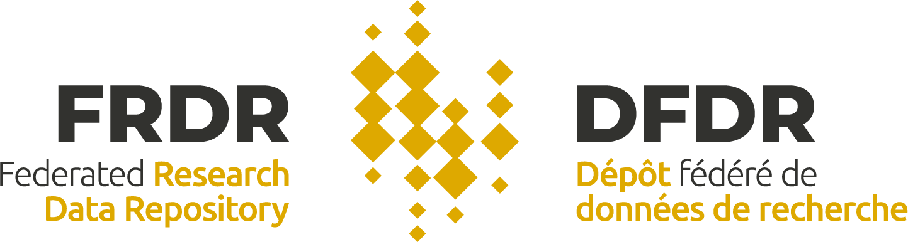

Another great option is the FRDR, which is available to any researcher affiliated with a Canadian institution. 

It's built for large datasets (1 TB+). The datasets are actively curated by professional staff at the FRDR.

The FRDR requires datasets to be open access, but they can be embargoed for a one-year period. For those working with sensitive data, the FRDR are working on a pilot project to add an optional zero-knowledge encryption to their repository, meaning that the FRDR will never be able to access the data. This allows you to deposit your data in a trusted data repository for archival purposes while maintaining complete control over access to the data. 

#### Controlled Access Management Pilot
FRDR is part of a Controlled Access Management pilot project to add optional zero-knowledge encryption to the repository. “Zero-knowledge encryption” means that FRDR will never be able to access your data directly. All datasets that are deposited are encrypted and their keys deposited into a separate researcher-managed platform. 

This allows you to store your data in a trusted repository for archival but still control a restricted access protocol.

If you're interested in piloting this service, email us at [rdm@mcmaster.ca](emailto:rdm@mcmaster.ca).

## Datasets as a Digital Object
When sharing datasets, there are a few things you need consider adding to ensure data is findable by other researchers, interconnected with publications and yourself, other researchers know how they are allowed to use it, and it will be available to other researchers in the long term. When sharing your datasets, you should share your:

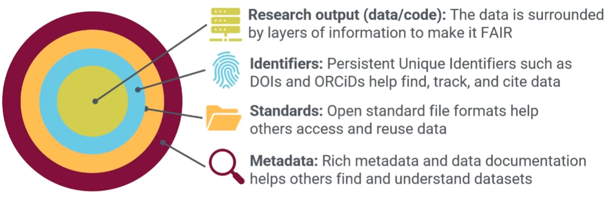 

### Persistent Identifiers

Persistent Identifiers (PIDs) help keep track of everything and make research searchable and citable. They're unique links that will never expire.

Digital Object Identifiers (DOIs)
: Can be created and used for **publications, datasets, lab equipment, research software**, and more.

Open Researcher and Contributor ID (ORCiD)
: Unique identifier for **researchers**. Distinguish yourself from scholars with the same name; connect your datasets, code, and publications.

ORCID is a community-build not-for-profit organization, and is free for users and sustained by member instituions. [Sign up for an ORCID here.](https://orcid.org/)

When you share data in a repository, the repository will create a DOI for your data. There are also fields to enter your publication DOI and the ORCIDs for researchers who worked on the project. 

*Make sure to add your dataset DOI and your ORCID to your publication as well!*

If you're interested in learning more, check out:
- "[Set yourself up for research success: Manage your data like a pro, and get your own ORCiD profile](https://scds.github.io/intro-rdm/researchsuccess.html)"
- "[What are ORCiDs and DOIs—and Why Do I Need Them?](https://scds.github.io/intro-rdm/doi-orcid.html)"

### Standards - Sustainable File Formats

Have you ever saved data on a CD, DVD, or Blu-ray? How about a zip drive or HD DVD? Do you use Google Docs or Prezi, where all your documents are stored online on a proprietary platform in a proprietary format? What would you do if that platform closed down?

Other researchers may not have access to any proprietary software you use, so data and metadata should ideally be stored in sustainable formats. Look for formats that are:
- Standardized
- Well documented
- In common usage
- Uncompressed

Research instrument files may be manufacturer-specific and should be converted to a sustainable format when possible. [Learn more about sustainable file formats here.](https://site.uit.no/dataverseno/deposit/prepare/
#what-are-preferred-file-formats)

### Data Licensing

If you don’t have a license for your data or code, it falls under the default copyright laws. This means nobody else can copy, distribute, or modify your work without being at risk. Not having an explicit license restricts others from using your code or data and causes confusion.

Licenses range from giving data into the public domain, where it is free for anyone to use for any purpose, to narrower licenses which may restrict use to non-commercial use only or require attribution to the author when the data is used. 

- Creative Commons (CC): [creativecommons.org](https://creativecommons.org/)
  - CC0 - public domain dedication
  - CC-BY - requires attribution
  - There are further restrictions that can be added, such as NC.
- Open Data Commons: [opendatacommons.org](https://opendatacommons.org/)
  - Similar licenses to CC but built for data
  - PDDL - Public Domain Dedication and License
  - ODC-By - require attribution
  - ODbL - attribution and share alike
- Traditional Knowledge (TK): [localcontexts.org/licenses](https://localcontexts.org/licenses)
  - In addition to the First Nations Information Governence Centre's OCAP training, communities may also choose to use TK licenses.

### Community Norms
In addition to licenses, there are also Dataverse Community Norms as well as scientific best practices which assert that proper credit should be given through citation of datasets. Dataverse and Open Data Commons community norms include:
- Share your work
- Credit and Cite the datasets you use
- Maintain the anonymity of human research participants
- Encourage others to reuse data
- Use open formats
- Don't use Digital Rights Management (DRM)

### Metadata + Documentation
The first step towards making a dataset FAIR is creating good metadata. Metadata is "data about data", and includes simple elements such as a dataset title, description, author list, date of creation, language, and a unique identifier/link such as a DOI. 

**Metadata**: When you deposit data in a repository, include metadata such as a title, date the data was collected, language, description, keywords, geographic location, and more. This helps other researchers narrow down the search and understand if the data is useful to them.

**Documentation**: Deposit a README file alongside your dataset to ensure others can understand how you gathered the data and how they can use it. The [Organization and Documentation](https://scds.github.io/rdm-best-practices/topics/2-organization-and-documentation.html) section of this module gives a bit more information about creating a README. 

## Open Access (OA) Publishing

Another important facet of research is Open Access Publishing. The Tri-Agency is requiring any publicly funded research to be published openly. We encourage all research to be published openly when possible!

### Publication Repositories
- Final manuscripts can be deposited in an institutional or disciplinary repository (such as [arXiv.org](https://arXiv.org)).
- Researchers are responsible for navigating the copyright requirements of the journal, but there are lots of resources available, and the library can assist you if you need help. [Learn more about Open Access at McMaster here.](https://library.mcmaster.ca/research/open-access#tab-open-access-publishing) 

### Journals
- Journal provides open access to the article (within 12 months).
- Most journals will charge open access fees. 

### MacSphere

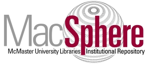

[MacSphere](https://macsphere.mcmaster.ca/) is McMaster's institutional repository, and it is the home for all scholarly documents, including publications, presentations, conference proceedings, theses, reports, and more.

If you're a McMaster graduate student, MacSphere is where you will publish your thesis once you graduate! We encourage graduate researchers to publish their data in McMaster Dataverse, their publication in MacSphere, and then link both using persistent identifiers. [Book a consultation with RDM Services to learn how!](https://u.mcmaster.ca/rdm-appointments)

You can access MacSphere by going to [macsphere.mcmaster.ca/](https://macsphere.mcmaster.ca/).

## Key Points / Summary

- Data sharing is important for data preservation and is an overall benefit to you as a researcher, to the research community, funders, and the public.
- Many journals and funders require data to be open.
- There are thousands of data repositories - RDM services can help you decide.
- Data should be shared in sustainable file formats, with a clear license and documentation.
- Connect your publication, dataset, and yourself through DOIs, ORCIDs, and other persistent identifiers. Graduate students should share data in McMaster Dataverse and connect it to their thesis in MacSphere. 

## Additional Resources

- [PLOS Data Availability Requirements](https://journals.plos.org/plosone/s/data-availability)
- [Nature Data Availability Requirements](https://www.nature.com/nature-portfolio/editorial-policies/reporting-standards)
- [NEJM Data Sharing Requirements](https://www.nejm.org/about-nejm/editorial-policies#:~:text=publicly%20accessible%20repository.-,Data%20Sharing,-The%20International%20Committee)
- [Dataverse Community Norms](https://dataverse.org/best-practices/dataverse-community-norms)

### Licensing
- [Creative Commons Licenses](https://creativecommons.org/)
- [Open Data Commons Licenses](https://opendatacommons.org/)
- [Traditional Knowledge Licenses](https://localcontexts.org/licenses)

### Repositories
- [arXiv](https://arXiv.org)
- [MacSphere](https://macsphere.mcmaster.ca/)
- [McMaster Dataverse](https://borealisdata.ca/dataverse/mcmaster)
- [Federated Research Data Repository (FRDR)](https://www.frdr-dfdr.ca/repo/)
- [Nature Scientific Data Recommended Data Repositories](https://www.nature.com/sdata/policies/repositories)
- [re3data Registry of Research Data Repositories](https://www.re3data.org/)
- [DataCite Repository Finder Tool](https://commons.datacite.org/repositories)

### Workshops
- [Essentials of Open Data Sharing](https://scds.github.io/intro-rdm/sharing.html)
- [What you need to know about the Tri-Agency RDM Policy](https://scds.github.io/intro-rdm/triagency.html)
- [Set yourself up for Research Success: Manage your Data like a Pro, and get your own ORCiD Profile](https://scds.github.io/intro-rdm/researchsuccess.html)
- [What are ORCiDs and DOIs—and Why Do I Need Them?](https://scds.github.io/intro-rdm/doi-orcid.html)
- [Depositing & Sharing Data Online with McMaster Dataverse](https://scds.github.io/intro-rdm/dataverse.html)

### References
